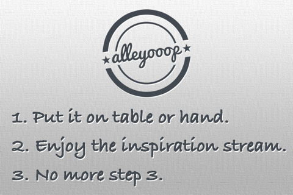

title: Alley Ooop - A stream of inspiration shots from dribbble
author: Makzan
date: 2011-10-31 20:00
template: article.jade

我非常熱愛 dribbble 這個專們給設計師分享手頭工作的網站，尤其喜歡在 Popular Shots 之間閒逛。某日心血來潮，寫了一個 dribbble slideshow app，名為 Alley Ooop。我把所有 dribbble 所需的操作都拿掉了，整個 app 唯一做的就是不斷播下一張 popular shot，自動地播。

這個 app 推出以來，反應一般。近日，終於讓我找到了知音人。他在 App Store review 中寫道：

> Great! 
> 
> by AlfredoGarcia1226
> 
> I love how I just display my iPhone on my dock while working on designs and at the same time not only view great art but get motivated! Great motivation! Good job!

我很高興有人懂得欣賞，這也給了我非常大的鼓舞。

　

▋Makzan • 金錢村 • 晴