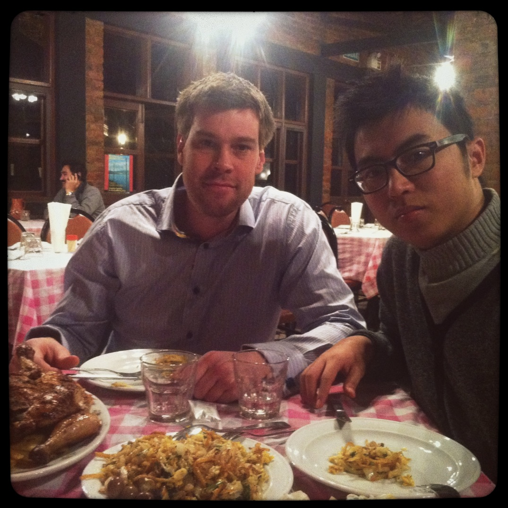
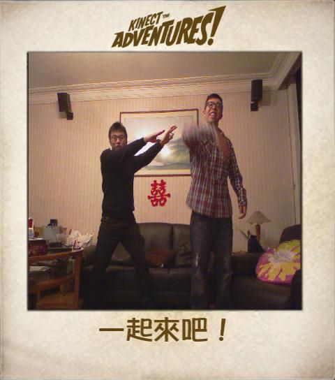

title: Friends, 有朋自遠方來的聖誕
author: makzan
date: 2011-12-30 22:00
template: article.jade

剛過去的聖誕，和好友一起度過了。有來自加拿大的 Rebecca 小姐，有來自瑞典的 Arwid 先生，有自中學便聚在一起的好友們晚餐。

It is really a nice Chrismas with friends from the other half of the Earth. Rebecca from Canada, Arwid from Sweden, and friends that grew up with me in Macao.

### Rebecca

I met Rebecca at WorldSkills 2011 in Calagry, Canada. She works there as a helper in the Web Design trade that I'm a member there. She came to Hong Kong during holiday and we hang out for dinner and sweats in Yuen Long.

### Arwid

Arwid is from Sweden. He is a web designing teacher and the expert of WorldSkills 2013 in Londan. He came to visit Hong Kong, Macao and GuongZou during Christmas and we had a tour together in Hong Kong and Macao, enjoying the delicious food.

### My Best Friends

Best friends that I grew up with. I can't imagine today's life without them.

　

▋Makzan • 澳門 • 晴