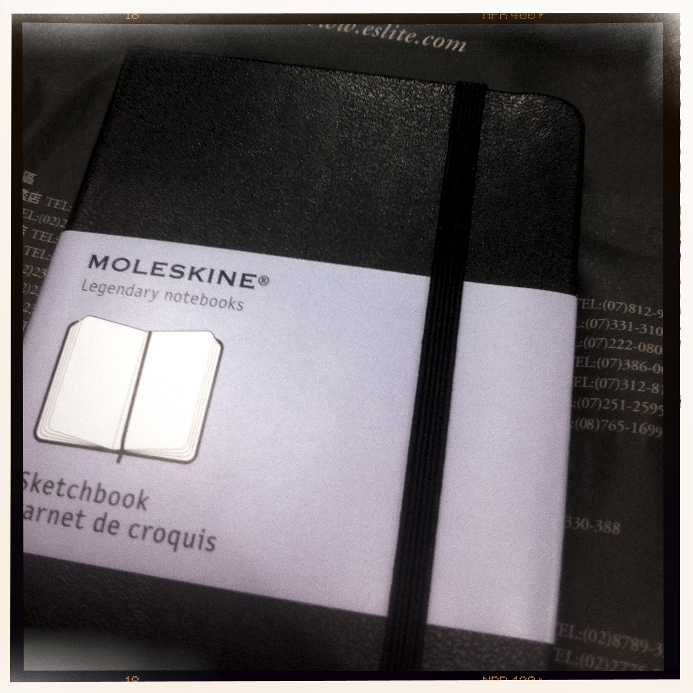
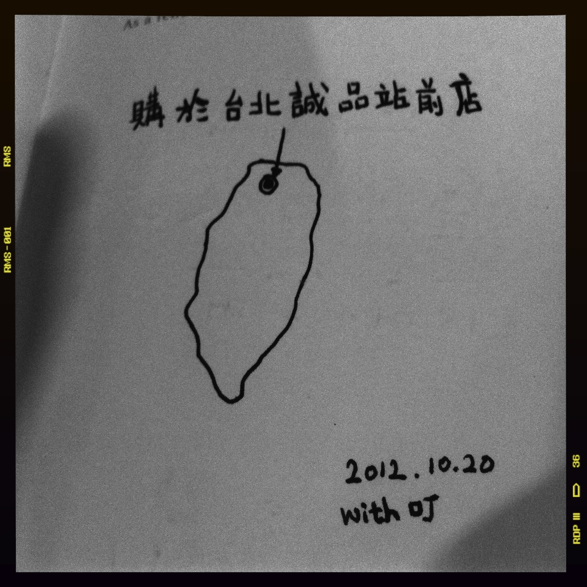

title: Finally I bought you, Moleskine
author: makzan
date: 2012-10-22 18:03
template: article.jade

之前[買左本畫簿黎畫野][1]，但都係唔可以底面同時畫，會過底，上網查過，Moleskine Heavy 紙真係可以一紙兩面畫，唔會過底，想買好耐，但太貴唔捨得買。

早兩日去台灣基隆（及台中）影婚紗相，路經台北，係台北站之誠品站前店買了兩本 Moleskine，算係買俾自己的廿六歲生日禮物，一本台幣 500 元，折約澳門幣 135 元，平過係澳門八佰伴買。

▋Makzan, Oct 2012, 誠品

[1]: /articles/2012-009-sketchnote-vs-iphone/
