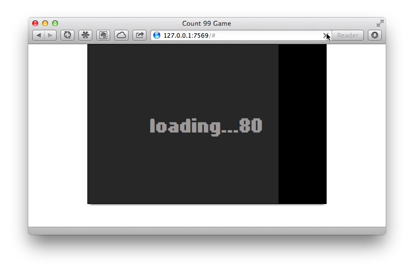

title: Count99 HTML5 Canvas Preloader
author: makzan
date: 2012-11-06 23:59
template: article.jade

Made a canvas preloading for the game graphics.

<video poster="screenshot.png" controls width="100%">
        <source src="articles/2012-020-count99-preloader/demo-count99-with-graphics-low.mp4" type='video/mp4; codecs="avc1.4D401E, mp4a.40.2"'>
</video>

And here is a video showing the preloading effect.

By the way, I used sloppy to simulate the slow internet connection.

▋Makzan, Nov 2012, NaviCake
