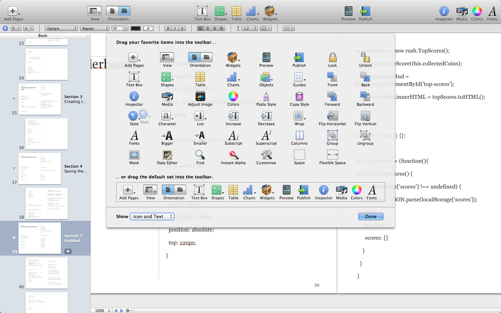
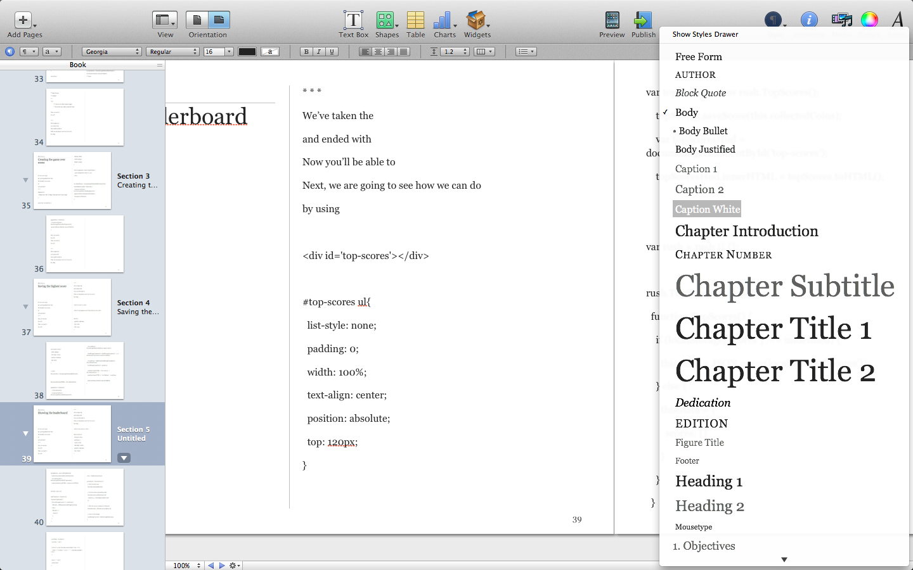

title: iBooks Author Style Drawer in Full Screen Mode
author: makzan
date: 2012-12-19 15:53
template: article.jade

__Problem__

The Sytle Drawer is invisible when using the iBooks Author in full screen mode, no matter I turned it on or not.

__Solution__

Here is how I get access to the style drawer in full screen mode.

Now I can access the drawer from the toolbar.
